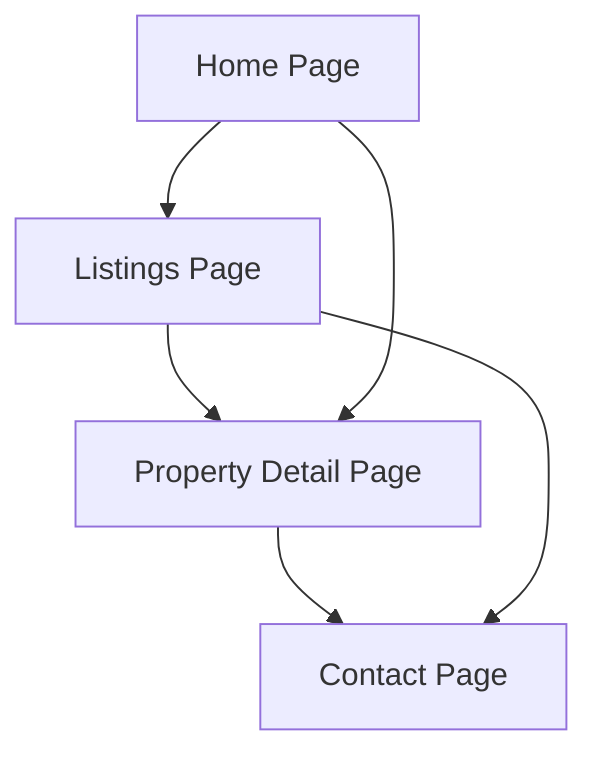

## 1. Product Overview
A high-end real estate platform showcasing luxury properties with brutalist editorial aesthetics. The site presents 5 premium listings through an intentionally minimal interface that emphasizes architectural photography and property details.

Target audience: High-net-worth individuals seeking exclusive properties. Market value: Premium positioning in luxury real estate sector through distinctive visual identity.

## 2. Core Features

### 2.1 User Roles
| Role | Registration Method | Core Permissions |
|------|---------------------|------------------|
| Visitor | No registration required | Browse listings, view property details |
| Prospective Buyer | Contact form submission | Save favorites, request viewings |

### 2.2 Feature Module
Our real estate platform consists of the following main pages:
1. **Home page**: Hero property showcase, featured listings grid, navigation.
2. **Listings page**: All properties grid, filtering options, search functionality.
3. **Property detail page**: High-resolution gallery, property specifications, contact form.
4. **Contact page**: Inquiry form, agent information, location details.

### 2.3 Page Details
| Page Name | Module Name | Feature description |
|-----------|-------------|---------------------|
| Home page | Hero section | Display featured property with full-screen imagery and minimal text overlay. |
| Home page | Featured listings | Grid of 3 premium properties with hover effects and quick view option. |
| Home page | Navigation | Fixed header with logo, menu items, and contact button. |
| Listings page | Property grid | Responsive grid displaying all 5 properties with image, price, and key details. |
| Listings page | Filter sidebar | Price range, property type, and location filters with smooth animations. |
| Property detail page | Image gallery | Full-screen image carousel with thumbnail navigation and zoom functionality. |
| Property detail page | Property info | Detailed specifications, amenities list, and property description. |
| Property detail page | Contact form | Simple form for scheduling viewings or requesting information. |
| Contact page | Inquiry form | Multi-step form for property inquiries with validation. |
| Contact page | Agent details | Agent photo, contact information, and expertise areas. |

## 3. Core Process
**Visitor Flow**: Home page → Browse listings → View property details → Contact agent
**Prospective Buyer Flow**: Home page → Filter properties → Save favorites → Schedule viewing

## 4. User Interface Design

### 4.1 Design Style
- **Primary colors**: Charcoal black (#1A1A1A), Concrete gray (#8B8B8B), Brutalist white (#FAFAFA)
- **Accent colors**: Industrial orange (#FF4500), Metallic silver (#C0C0C0)
- **Typography**: Monumental sans-serif headers (Space Grotesk/Neue Haas Grotesk), Clean body text (Suisse International)
- **Button style**: Sharp rectangular edges, heavy weight, hover state with color inversion
- **Layout style**: Asymmetric grid system, generous whitespace, overlapping elements
- **Icon style**: Geometric, line-based icons with heavy stroke weight

### 4.2 Page Design Overview
| Page Name | Module Name | UI Elements |
|-----------|-------------|-------------|
| Home page | Hero section | Full-screen property image with brutalist typography overlay, minimal navigation indicators. |
| Home page | Featured listings | Asymmetric grid with 2:1:2 ratio, hover reveals price and specs with slide animation. |
| Listings page | Property grid | 3-column masonry layout on desktop, 2-column on tablet, single column on mobile. |
| Property detail page | Image gallery | Full-width carousel with brutalist pagination dots, swipe gestures enabled. |
| Contact page | Inquiry form | Stacked form fields with heavy borders, error states in industrial orange. |

### 4.3 Responsiveness
Desktop-first approach with mobile-adaptive breakpoints. Touch interactions optimized for tablet viewing of property galleries. Minimal navigation transforms to brutalist hamburger menu on mobile.

### 4.4 3D Scene Guidance
Not applicable for this 2D editorial-focused real estate platform.