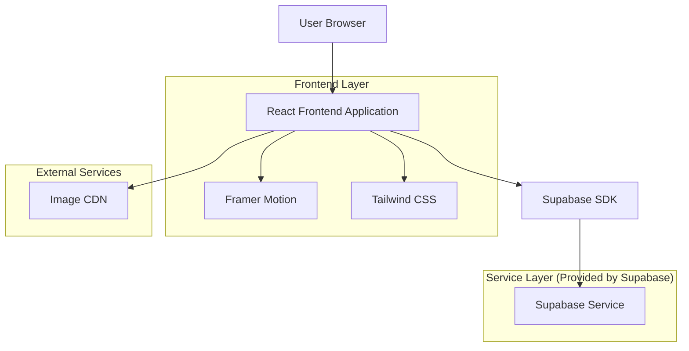
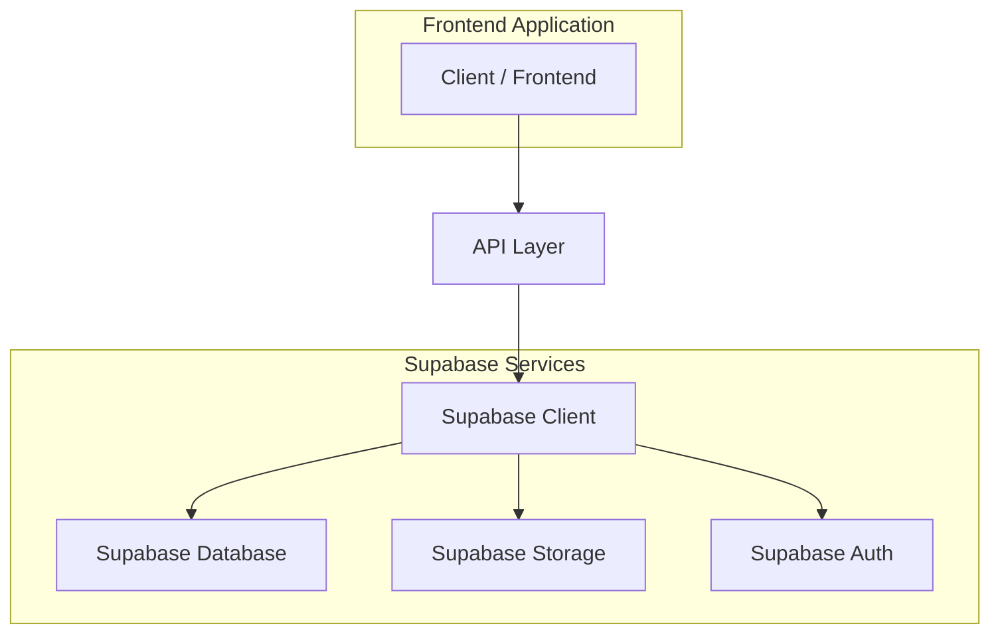
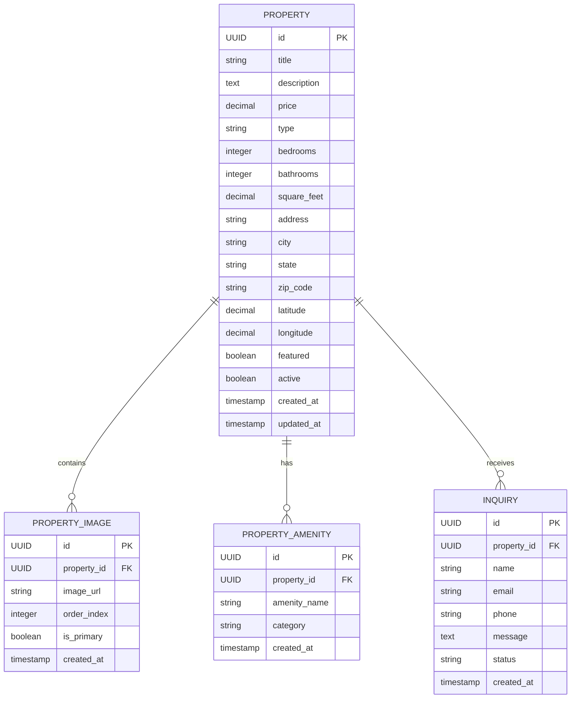

## 1. Architecture design



## 2. Technology Description
- Frontend: React@18 + Tailwind CSS@3 + Framer Motion@10
- Initialization Tool: vite-init
- Backend: Supabase (PostgreSQL, Authentication, Storage)
- State Management: React Context + Supabase Real-time
- Build Tool: Vite@4

## 3. Route definitions
| Route | Purpose |
|-------|---------|
| / | Home page with featured properties and hero section |
| /listings | All property listings with filtering capabilities |
| /property/:id | Individual property detail page with gallery |
| /contact | Contact form for property inquiries |
| /about | Agency information and team details |

## 4. API definitions

### 4.1 Property Management APIs

```
GET /api/properties
```

Request:
| Param Name | Param Type | isRequired | Description |
|------------|------------|------------|-------------|
| limit | number | false | Number of properties to return (default: 10) |
| offset | number | false | Pagination offset |
| price_min | number | false | Minimum price filter |
| price_max | number | false | Maximum price filter |
| type | string | false | Property type filter |

Response:
| Param Name | Param Type | Description |
|------------|------------|-------------|
| properties | array | Array of property objects |
| total | number | Total count of properties |

### 4.2 Property Detail API

```
GET /api/properties/:id
```

Response:
| Param Name | Param Type | Description |
|------------|------------|-------------|
| id | string | Unique property identifier |
| title | string | Property title |
| price | number | Property price |
| images | array | Array of image URLs |
| specifications | object | Property details and amenities |
| location | object | Address and coordinates |

## 5. Server architecture diagram



## 6. Data model

### 6.1 Data model definition


### 6.2 Data Definition Language

Property Table (properties)
```sql
-- create table
CREATE TABLE properties (
    id UUID PRIMARY KEY DEFAULT gen_random_uuid(),
    title VARCHAR(255) NOT NULL,
    description TEXT,
    price DECIMAL(12,2) NOT NULL,
    type VARCHAR(50) NOT NULL CHECK (type IN ('house', 'apartment', 'condo', 'townhouse', 'villa')),
    bedrooms INTEGER NOT NULL DEFAULT 0,
    bathrooms INTEGER NOT NULL DEFAULT 0,
    square_feet DECIMAL(8,2),
    address VARCHAR(255) NOT NULL,
    city VARCHAR(100) NOT NULL,
    state VARCHAR(50) NOT NULL,
    zip_code VARCHAR(20),
    latitude DECIMAL(10,8),
    longitude DECIMAL(11,8),
    featured BOOLEAN DEFAULT false,
    active BOOLEAN DEFAULT true,
    created_at TIMESTAMP WITH TIME ZONE DEFAULT NOW(),
    updated_at TIMESTAMP WITH TIME ZONE DEFAULT NOW()
);

-- create indexes
CREATE INDEX idx_properties_featured ON properties(featured) WHERE featured = true;
CREATE INDEX idx_properties_active ON properties(active) WHERE active = true;
CREATE INDEX idx_properties_price ON properties(price);
CREATE INDEX idx_properties_type ON properties(type);
CREATE INDEX idx_properties_location ON properties(city, state);

-- grant permissions
GRANT SELECT ON properties TO anon;
GRANT ALL PRIVILEGES ON properties TO authenticated;
```

Property Images Table (property_images)
```sql
-- create table
CREATE TABLE property_images (
    id UUID PRIMARY KEY DEFAULT gen_random_uuid(),
    property_id UUID NOT NULL REFERENCES properties(id) ON DELETE CASCADE,
    image_url VARCHAR(500) NOT NULL,
    order_index INTEGER DEFAULT 0,
    is_primary BOOLEAN DEFAULT false,
    created_at TIMESTAMP WITH TIME ZONE DEFAULT NOW()
);

-- create indexes
CREATE INDEX idx_property_images_property_id ON property_images(property_id);
CREATE INDEX idx_property_images_primary ON property_images(is_primary) WHERE is_primary = true;

-- grant permissions
GRANT SELECT ON property_images TO anon;
GRANT ALL PRIVILEGES ON property_images TO authenticated;
```

Inquiries Table (inquiries)
```sql
-- create table
CREATE TABLE inquiries (
    id UUID PRIMARY KEY DEFAULT gen_random_uuid(),
    property_id UUID NOT NULL REFERENCES properties(id) ON DELETE CASCADE,
    name VARCHAR(100) NOT NULL,
    email VARCHAR(255) NOT NULL,
    phone VARCHAR(20),
    message TEXT,
    status VARCHAR(20) DEFAULT 'new' CHECK (status IN ('new', 'contacted', 'viewing_scheduled', 'closed')),
    created_at TIMESTAMP WITH TIME ZONE DEFAULT NOW()
);

-- create indexes
CREATE INDEX idx_inquiries_property_id ON inquiries(property_id);
CREATE INDEX idx_inquiries_status ON inquiries(status);
CREATE INDEX idx_inquiries_created_at ON inquiries(created_at DESC);

-- grant permissions
GRANT SELECT ON inquiries TO anon;
GRANT ALL PRIVILEGES ON inquiries TO authenticated;
```

### 6.3 Mock Data Initialization
```sql
-- Insert 5 luxury properties
INSERT INTO properties (title, description, price, type, bedrooms, bathrooms, square_feet, address, city, state, zip_code, featured) VALUES
('Brutalist Concrete Villa', 'Striking architectural masterpiece featuring raw concrete finishes and expansive glass walls.', 2850000, 'house', 4, 3, 4200, '123 Brutalist Avenue', 'Los Angeles', 'CA', '90210', true),
('Industrial Loft Penthouse', 'Converted warehouse space with 20-foot ceilings and exposed steel beams.', 1650000, 'apartment', 2, 2, 2800, '456 Industrial Way', 'New York', 'NY', '10013', true),
('Minimalist Glass House', 'Transparent living spaces floating above the landscape with uninterrupted views.', 3200000, 'house', 3, 2.5, 3500, '789 Glass Ridge', 'Malibu', 'CA', '90265', false),
('Raw Concrete Townhouse', 'Five-story urban dwelling with brutalist facade and rooftop terrace.', 1950000, 'townhouse', 3, 3, 3100, '321 Concrete Street', 'San Francisco', 'CA', '94105', false),
('Editorial Penthouse Suite', 'Magazine-worthy interiors with custom furniture and art installations.', 4200000, 'condo', 4, 4, 4500, '654 Skyline Plaza', 'Miami', 'FL', '33139', true);

-- Insert property images for each listing
INSERT INTO property_images (property_id, image_url, order_index, is_primary) VALUES
((SELECT id FROM properties WHERE title = 'Brutalist Concrete Villa'), 'https://images.unsplash.com/photo-1600585154340-be6161a56a0c', 0, true),
((SELECT id FROM properties WHERE title = 'Brutalist Concrete Villa'), 'https://images.unsplash.com/photo-1600607687939-ce8a6c25118c', 1, false),
((SELECT id FROM properties WHERE title = 'Industrial Loft Penthouse'), 'https://images.unsplash.com/photo-1600607687644-c7171b42498b', 0, true),
((SELECT id FROM properties WHERE title = 'Industrial Loft Penthouse'), 'https://images.unsplash.com/photo-1600607687939-ce8a6c25118c', 1, false),
((SELECT id FROM properties WHERE title = 'Minimalist Glass House'), 'https://images.unsplash.com/photo-1600607687920-4e2a09cf159d', 0, true),
((SELECT id FROM properties WHERE title = 'Raw Concrete Townhouse'), 'https://images.unsplash.com/photo-1600607687644-c7171b42498b', 0, true),
((SELECT id FROM properties WHERE title = 'Editorial Penthouse Suite'), 'https://images.unsplash.com/photo-1600607920-4e2a09cf159d', 0, true);
```